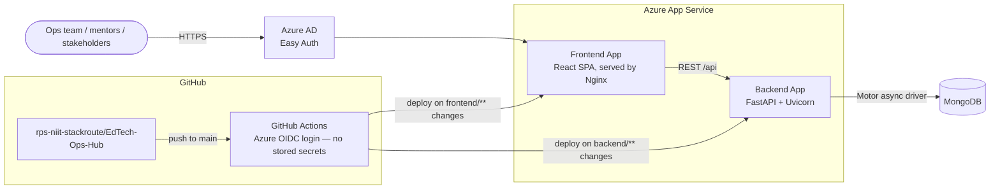
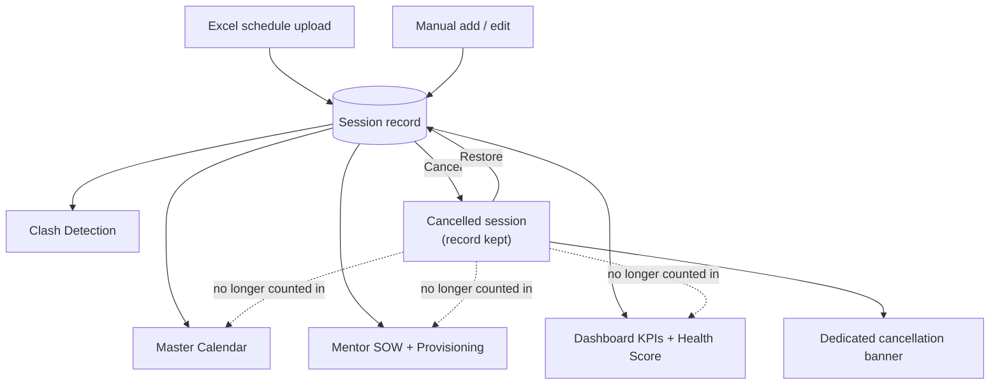

# EdTech Ops Hub

An internal operations platform for NIIT Enterprise / StackRoute that replaces
manual, Excel-driven workflows with one system for program scheduling, mentor
management, attendance processing, and client billing (SOW).

---

## What This Tool Does

EdTech Ops Hub is the single source of truth for everything a delivery program
touches after it's sold: who's mentoring, when sessions run, whether anyone's
double-booked, what attendance looked like, and what a client should be
billed for it. Change something once — a reschedule, a cancellation, a
re-uploaded schedule — and the calendar, the SOW, and the dashboard all stay
in sync automatically, with a visible trail of what changed and why.

### Feature Overview

**Operations Dashboard**
- Live KPIs — active programs, sessions this week, active mentors, clashes
  detected, hours billed this month, average attendance/attentiveness
- Program health score distribution, sessions-per-week trend, top mentor
  workload
- A 7-day rolling notification for schedule changes (reschedules/removals)
  and a **separate** notification for cancellations — cancelling a session
  quietly shrinks a SOW rather than just moving it, so it gets its own
  callout instead of hiding in a general changes list

**Programs & Scheduling**
- Full program CRUD — client, project/SOW code, team owner, mentors, status
- Bulk schedule import from Excel with automatic mentor-conflict detection
  and an in-app resolver for anything that clashes
- **Schedule re-upload** — replace an entire program's schedule from a fresh
  Excel file in one step (for when there are too many date changes to edit
  one by one) without touching the program's client/name/code/team history
- **Session cancellation** — a placeholder, not a delete: a cancelled
  session keeps its record but drops out of the calendar, the SOW, and
  mentor-availability checks as if it never happened, and can be restored
  later (re-checked for conflicts first)

**Calendar**
- Month and week views across every program at once
- Live mentor clash (double-booking) detection
- A mentor-unavailability banner that links straight into managing it

**Mentor Management**
- Mentor directory with contact info, notes, active/inactive status
- Mentor unavailability periods (leave, blocked dates), enforced
  automatically anywhere a session is booked or edited
- Real-time availability checking while scheduling

**Attendance Processing**
- Upload a raw session export and get back a consolidated tracker
- Fuzzy name and email matching against the mentor/learner roster
- Attendance duration capped by the session's actual scheduled time, not a
  stray value from the export
- Feeds each program's health score automatically

**Mentor SOW & Billing**
- Auto-generated monthly SOW per mentor, computed from actual session
  start/end time (not a possibly-stale duration column)
- Diff view against the previous month's SOW — changed cells highlighted
  old value → new value
- Full SOW history log of what was downloaded and when
- A separate **Provisioning** module for hourly-rate mentors and one-off
  charges, with its own billing export

**Feedback Consolidation**
- Merges a raw feedback-form export into a program's tracker, filling in
  date/module/mentor automatically from the schedule

**Access Control**
- JWT (httpOnly cookie) authentication, with Azure AD (Easy Auth) fronting
  it in production
- Three roles: **admin** (full access), **team_member** (their own programs
  only), **viewer** (read-only dashboard for stakeholders)

**Audit Log & Backups**
- Every state-changing action is logged with actor, action, and detail
- On-demand full-data ZIP backup and exportable audit log

**Quality**
- 267 backend unit tests + 122 integration tests (pytest, against a real
  throwaway MongoDB)
- 140+ frontend tests (Jest + React Testing Library)
- SonarQube scan setup included (`sonarqube/`)

---

## Architecture



### One record, many views

A session is entered once — by hand or by Excel upload — and every other
part of the app reads from that same record. Cancelling it pulls it back out
of everything downstream without deleting the history:



---

## Tech Stack

### Frontend
| Layer | Technology |
|---|---|
| Framework | React 19 (JavaScript / JSX) |
| Build Tool | CRACO (Create React App Configuration Override) |
| Routing | react-router-dom 7 |
| Styling | Tailwind CSS + custom CSS variables |
| UI Components | shadcn/ui (Radix UI primitives) |
| Icons | lucide-react |
| Charts | Recharts |
| HTTP Client | Axios (withCredentials for cookie auth) |
| Notifications | Sonner |
| Date Handling | dayjs |
| Testing | Jest + React Testing Library |
| Package Manager | npm |

### Backend
| Layer | Technology |
|---|---|
| Framework | FastAPI 0.110 (Python 3.11) |
| Server | Uvicorn |
| Database | MongoDB via Motor (async) + PyMongo |
| Authentication | JWT (PyJWT) in httpOnly cookies + bcrypt |
| Excel Processing | openpyxl |
| Validation | Pydantic v2 |
| Testing | pytest (unit + integration) |

### Infrastructure
| Layer | Technology |
|---|---|
| Containerisation | Docker + Docker Compose (local dev) |
| Production Hosting | Azure App Service (frontend + backend, deployed independently) |
| Frontend Serving | Nginx (local/Docker) |
| Database | MongoDB |
| CI/CD | GitHub Actions, path-filtered per app, Azure OIDC (no stored credentials) |
| Access Gate | Azure AD Easy Auth (production) |

---

## Getting Started (Local Development)

### Prerequisites
- Docker Desktop installed and running
- Git

### Steps

**1. Clone the repository**
```bash
git clone https://github.com/rps-niit-stackroute/EdTech-Ops-Hub.git
cd EdTech-Ops-Hub
```

**2. Set up environment variables**

Create `backend/.env`:
```dotenv
MONGO_URL=mongodb://mongo:27017
DB_NAME=edtech_ops_production
CORS_ORIGINS=http://localhost:3000
JWT_SECRET=your-64-char-hex-secret-here
ADMIN_USERNAME=admin
ADMIN_PASSWORD=admin123
NODE_ENV=production
```

Create `frontend/.env`:
```dotenv
REACT_APP_BACKEND_URL=http://localhost:8001
NODE_ENV=production
```

**3. Start all containers**
```bash
docker compose up --build
```

**4. Open in browser**

http://localhost:3000

**5. Login with default credentials**

Username: `admin`
Password: `admin123`

You will be prompted to change the password on first login.

### Running the tests
```bash
# Backend — from backend/, with a Python 3.11+ venv active
python -m pytest tests/unit -q                # no DB required
python -m pytest tests/integration -q          # needs Mongo running (docker compose up -d mongo)

# Frontend — from frontend/
CI=true npx craco test --watchAll=false
```

### Stopping the app
```bash
docker compose down
```

---

## Environment Variables

### Backend (`backend/.env`)

| Variable | Description | Example |
|---|---|---|
| `MONGO_URL` | MongoDB connection string | `mongodb://mongo:27017` |
| `DB_NAME` | Database name | `edtech_ops_production` |
| `CORS_ORIGINS` | Allowed frontend origins (comma separated) | `http://localhost:3000` |
| `JWT_SECRET` | 64-char hex string for signing JWT tokens | generate with `openssl rand -hex 32` |
| `ADMIN_USERNAME` | Default admin username | `admin` |
| `ADMIN_PASSWORD` | Default admin password | `admin123` |
| `ENABLE_API_DOCS` | Turn on `/docs` and `/redoc` (off by default) | `true` |
| `COOKIE_SECURE` | Require HTTPS for the auth cookie | `true` in production |
| `NODE_ENV` | Environment | `production` |

### Frontend (`frontend/.env`)

| Variable | Description | Example |
|---|---|---|
| `REACT_APP_BACKEND_URL` | Backend API base URL | `http://localhost:8001` |
| `NODE_ENV` | Environment | `production` |

---

## API Overview

All backend routes are prefixed with `/api`. The full interactive spec is
available at `/docs` when `ENABLE_API_DOCS=true`. Grouped by resource:

| Area | Routes |
|---|---|
| Auth | `POST /auth/login`, `POST /auth/viewer-login`, `POST /auth/logout`, `GET /auth/me`, `POST /auth/change-password` |
| Users | `GET/POST /users`, `PUT/DELETE /users/{id}` |
| Dashboard | `GET /dashboard` |
| Programs | `GET/POST /programs`, `GET/PUT/DELETE /programs/{id}`, `GET /programs/{id}/health`, `PATCH /programs/{id}/status` |
| Schedule Upload | `POST /programs/{id}/schedule`, `POST /programs/{id}/schedule/replace`, `POST /programs/{id}/sessions/bulk` |
| Sessions | `POST /sessions`, `PUT /sessions/{id}`, `PATCH /sessions/{id}/status` (cancel/restore), `DELETE /sessions/{id}`, `POST /availability/check` |
| Calendar | `GET /calendar`, `GET /clashes`, `GET /schedule-changes/recent` |
| Mentors | `GET/POST /mentors`, `PUT/DELETE /mentors/{id}`, `GET/POST /mentor-unavailability`, `DELETE /mentor-unavailability/{id}` |
| Attendance | `POST /attendance/update`, `POST /attendance/update-batch`, `POST /attendance/detect-date` |
| SOW | `GET /sow`, `GET/POST /sow/download`, `GET /sow/history` |
| Provisioning | `GET/POST /provision/mentors`, `PUT/DELETE /provision/mentors/{id}`, `GET /provision`, `GET /provision/download`, `POST /provision/charges`, `DELETE /provision/charges/{id}` |
| Audit & Backup | `GET /audit`, `GET /audit/export`, `GET /admin/backup`, `GET /admin/backup/last` |
| Meta | `GET /meta` |

---

## Deployment

Production runs on **Azure App Service** — a frontend Web App and a backend
Web App, each deployed independently by its own GitHub Actions workflow
(`.github/workflows/`) on push to `main`, path-filtered so a frontend-only
change doesn't redeploy the backend and vice versa. Both workflows
authenticate to Azure via **OIDC** (`azure/login@v2`), so no long-lived
Azure credentials are stored as GitHub secrets.

For the full setup — Azure AD Easy Auth configuration, custom domain/SSL,
environment variables per app, and a step-by-step provisioning runbook —
see [`docs/azure-deployment.md`](docs/azure-deployment.md) and
[`docs/StackRoute-Ops-Azure-Deployment-Runbook.pdf`](docs/StackRoute-Ops-Azure-Deployment-Runbook.pdf).

**Note for any manual Docker build:** `REACT_APP_BACKEND_URL` must be passed
as a build argument, since CRA inlines it at build time, not at runtime:
```bash
docker build -f Dockerfile.frontend \
  --build-arg REACT_APP_BACKEND_URL=https://your-backend-url.com \
  -t edtech-frontend .
```

---

## Known Notes

- The app was initially scaffolded using the Emergent AI-assisted development
  platform and has since been fully customised, containerised, and prepared
  for independent deployment
- Use **npm** for all frontend package operations (`package-lock.json` is
  the source of truth — there's no `yarn.lock`)
- The repository lives under the shared `rps-niit-stackroute` GitHub
  organization rather than a personal account, so access isn't tied to one
  person

---

## Maintainers

Maintained by the NIIT Enterprise / StackRoute Ops team, under the
[`rps-niit-stackroute`](https://github.com/rps-niit-stackroute) organization.
